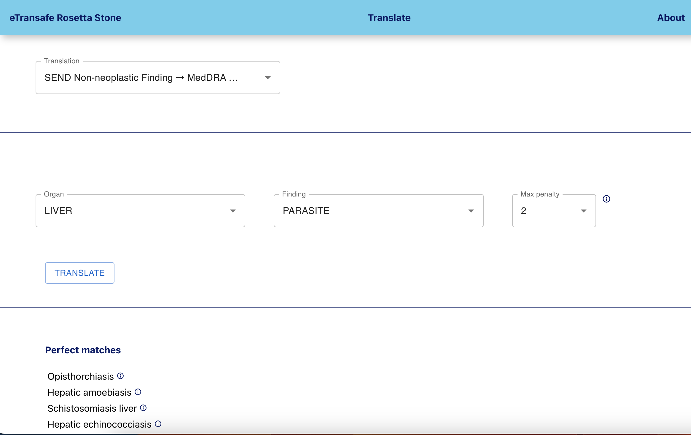

# eTransafe Rosetta Stone UI

**A simple React interface for the eTransafe Rosetta Stone**

A working version of the UI is available [here](https://emc-mi-notebooks.nl)

### REQUIREMENTS

- The eTransafe Rosetta Stone back-end up and running. It is
  available [here](https://github.com/mi-erasmusmc/ets-rosetta-stone)
- [Node.js and NPM](https://docs.npmjs.com/downloading-and-installing-node-js-and-npm)

### HOW TO USE

Install the required packages with `npm install`

Set the url for the eTransafe Rosetta Stone back-end in the .env file

From the project directory, you can run `npm start`
This runs the app in development mode.
Open [http://localhost:4200](http://localhost:4200) to view it in the browser.
The page reloads when you make edits.

`npm run build` builds the app for production to the `build` folder.\
It bundles React in production mode and optimizes the build for the best performance.

### DOCKER

The dockerfile builds the app and exposes it through NGINX you can pass the same values present in the .env file as
environment variables for your container in order to run the same build in different environments.

### CONTRIBUTIONS

This code was copy-pasted together by a back-end developer, contributions are welcome :-)
